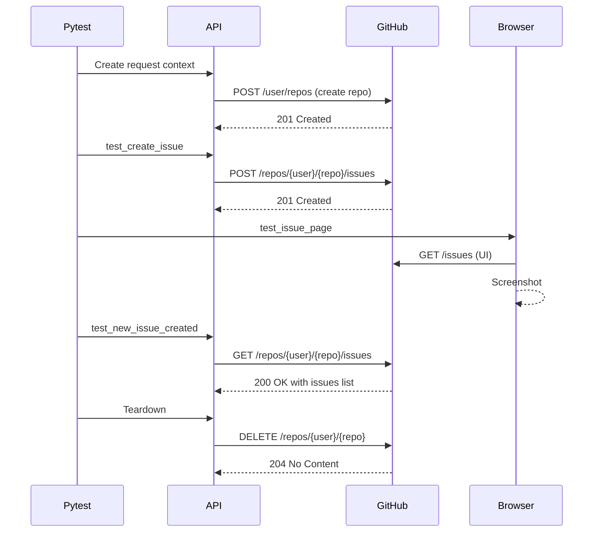

## Overview

This example demonstrates a powerful testing pattern that combines API and UI testing in a single test suite. You'll learn how to use Playwright's API testing capabilities to create GitHub issues programmatically, then verify them through both API responses and the browser UI.

## What You'll Learn

<CardGroup cols={2}>
  <Card title="API Testing" icon="plug">
    Test REST APIs with Playwright's built-in request context
  </Card>
  <Card title="Hybrid Testing" icon="layer-group">
    Combine API and UI tests for comprehensive coverage
  </Card>
  <Card title="Test Fixtures" icon="flask">
    Create reusable test fixtures for setup and teardown
  </Card>
  <Card title="GitHub Integration" icon="github">
    Authenticate and interact with GitHub's REST API
  </Card>
</CardGroup>

## Architecture

This example follows a sophisticated testing pattern:

1. **Setup**: Create a temporary GitHub repository via API
2. **Test**: Create issues via API, verify via UI and API
3. **Teardown**: Clean up by deleting the repository via API

<Note>
**Why Combine API and UI Testing?**

API testing is fast and reliable for data operations, while UI testing ensures the user experience is correct. Combining both gives you confidence that:
- The API works correctly (backend verification)
- The UI displays the correct data (frontend verification)
- The integration between API and UI is functioning
</Note>

## Prerequisites

### GitHub Personal Access Token

You'll need a GitHub Personal Access Token with `repo` scope:

1. Go to GitHub Settings → Developer settings → Personal access tokens → Tokens (classic)
2. Generate new token with `repo` scope
3. Save the token securely

### Credentials File

Create a `creds.py` file (add to `.gitignore`):

```python creds.py
# GitHub credentials - DO NOT COMMIT
GITHUB_USER = "your-username"
GITHUB_TOKEN = "ghp_your_personal_access_token"
GITHUB_REPO = "playwright-test-repo"
```

<Warning>
**Security Warning:**

Never commit credentials to version control. Always add `creds.py` to your `.gitignore`:

```bash .gitignore
creds.py
*.json
auth_token.txt
```
</Warning>

## Implementation

### Configuration and Fixtures

The `conftest.py` file sets up shared fixtures for API testing and repository lifecycle management.

```python conftest.py
import pytest
from creds import *
from playwright.sync_api import *


@pytest.fixture(scope="session")
def api_context(playwright: Playwright):
    headers = {
        # We set this header per GitHub guidelines.
        "Accept": "application/vnd.github.v3+json",
        # Access token
        "Authorization": f"token {GITHUB_TOKEN}"
    }
    context = playwright.request.new_context(
        base_url="https://api.github.com/",
        extra_http_headers=headers,
    )
    yield context
    context.dispose()


@pytest.fixture(scope="session", autouse=True)
def create_test_repository(api_context: APIRequestContext):
    # Before all
    new_repo = api_context.post("/user/repos", data={"name": GITHUB_REPO})
    assert new_repo.ok
    yield
    # After all
    deleted_repo = api_context.delete(f"/repos/{GITHUB_USER}/{GITHUB_REPO}")
    assert deleted_repo.ok
```

**Key Concepts:**

<Steps>
  <Step title="API Request Context">
    The `api_context` fixture creates a reusable request context with:
    - **Base URL**: All requests are relative to `https://api.github.com/`
    - **Authentication**: Token added to all requests automatically
    - **Headers**: GitHub API version specified
    - **Session Scope**: Shared across all tests
  </Step>
  
  <Step title="Repository Lifecycle">
    The `create_test_repository` fixture with `autouse=True`:
    - **Runs automatically** before any tests
    - **Creates repository** via POST to `/user/repos`
    - **Yields** to run all tests
    - **Deletes repository** via DELETE after all tests complete
    - **Session scope** ensures setup/teardown happens only once
  </Step>
</Steps>

### Test Implementation

The test file demonstrates three complementary test approaches:

```python test_github_issue.py
from creds import *
from playwright.sync_api import *


def test_create_issue(api_context: APIRequestContext):
    issue_data = {
        "title": "[Bug] That failed",
        "body": "When running this, that failed with error.",
    }

    issue = api_context.post(
        f"/repos/{GITHUB_USER}/{GITHUB_REPO}/issues",
        data=issue_data,
    )

    assert issue.ok


def test_issue_page(page: Page):
    page.goto(f"https://github.com/{GITHUB_USER}/{GITHUB_REPO}/issues")
    page.screenshot(path="issues-page.jpg", full_page=True)


def test_new_issue_created(api_context: APIRequestContext):
    all_issues = api_context.get(
        f"/repos/{GITHUB_USER}/{GITHUB_REPO}/issues",
    )

    assert all_issues.ok

    new_issue = [
        issue 
        for issue in all_issues.json()
        if issue["title"] == "[Bug] That failed"
    ][0]

    assert new_issue["body"] == "When running this, that failed with error."
```

## Test Breakdown

### Test 1: Create Issue via API

```python
def test_create_issue(api_context: APIRequestContext):
    issue_data = {
        "title": "[Bug] That failed",
        "body": "When running this, that failed with error.",
    }

    issue = api_context.post(
        f"/repos/{GITHUB_USER}/{GITHUB_REPO}/issues",
        data=issue_data,
    )

    assert issue.ok
```

**What This Tests:**
- API endpoint responds successfully
- Issue creation via API works
- Authentication and permissions are correct

**Key Methods:**
- `api_context.post()`: Makes POST request
- `data=issue_data`: Automatically serialized to JSON
- `issue.ok`: Checks for 2xx status code

### Test 2: Capture UI Screenshot

```python
def test_issue_page(page: Page):
    page.goto(f"https://github.com/{GITHUB_USER}/{GITHUB_REPO}/issues")
    page.screenshot(path="issues-page.jpg", full_page=True)
```

**What This Tests:**
- Issues page loads without errors
- Visual regression testing capability
- UI accessibility and rendering

**Key Methods:**
- `page.goto()`: Navigate to issues page
- `page.screenshot()`: Capture full page screenshot
- `full_page=True`: Scrolls and captures entire page

### Test 3: Verify Issue via API

```python
def test_new_issue_created(api_context: APIRequestContext):
    all_issues = api_context.get(
        f"/repos/{GITHUB_USER}/{GITHUB_REPO}/issues",
    )

    assert all_issues.ok

    new_issue = [
        issue 
        for issue in all_issues.json()
        if issue["title"] == "[Bug] That failed"
    ][0]

    assert new_issue["body"] == "When running this, that failed with error."
```

**What This Tests:**
- Issue persists after creation
- Issue data matches what was submitted
- List endpoint returns correct data

**Key Methods:**
- `api_context.get()`: Makes GET request
- `all_issues.json()`: Parse JSON response
- List comprehension: Filter issues by title

## Advanced Patterns

### Error Handling

```python
def test_create_issue_with_validation(api_context: APIRequestContext):
    # Test successful creation
    response = api_context.post(
        f"/repos/{GITHUB_USER}/{GITHUB_REPO}/issues",
        data={"title": "Valid Issue", "body": "Description"},
    )
    assert response.ok
    assert response.status == 201
    
    # Test validation errors
    invalid_response = api_context.post(
        f"/repos/{GITHUB_USER}/{GITHUB_REPO}/issues",
        data={},  # Missing required title
    )
    assert not invalid_response.ok
    assert invalid_response.status == 422
```

### Response Data Validation

```python
def test_issue_response_structure(api_context: APIRequestContext):
    response = api_context.post(
        f"/repos/{GITHUB_USER}/{GITHUB_REPO}/issues",
        data={"title": "Test Issue", "body": "Test body"},
    )
    
    issue = response.json()
    
    # Validate response structure
    assert "id" in issue
    assert "number" in issue
    assert issue["title"] == "Test Issue"
    assert issue["body"] == "Test body"
    assert issue["state"] == "open"
    assert issue["user"]["login"] == GITHUB_USER
```

### Combining API and UI Assertions

```python
def test_issue_appears_in_ui(api_context: APIRequestContext, page: Page):
    # Create issue via API
    issue_title = "UI Verification Test"
    response = api_context.post(
        f"/repos/{GITHUB_USER}/{GITHUB_REPO}/issues",
        data={"title": issue_title, "body": "Test body"},
    )
    assert response.ok
    
    # Verify in UI
    page.goto(f"https://github.com/{GITHUB_USER}/{GITHUB_REPO}/issues")
    issue_link = page.get_by_role("link", name=issue_title)
    expect(issue_link).to_be_visible()
    
    # Click and verify details
    issue_link.click()
    expect(page.locator(".gh-header-title")).to_have_text(issue_title)
```

## Running the Tests

<CodeGroup>
```bash Run All Tests
# Run the complete test suite
pytest test_github_issue.py -v
```

```bash Run Specific Test
# Run only the API test
pytest test_github_issue.py::test_create_issue -v
```

```bash Keep Repository for Debugging
# Skip teardown to inspect created repository
pytest test_github_issue.py -v --setup-show
```

```bash Run with Headed Browser
# See UI tests in action
pytest test_github_issue.py --headed --slowmo 1000
```
</CodeGroup>

## Test Execution Flow



## Best Practices

<CardGroup cols={2}>
  <Card title="Use Session Fixtures" icon="layer-group">
    Share expensive setup (like API contexts) across tests with `scope="session"`
  </Card>
  
  <Card title="Clean Up Resources" icon="trash">
    Always delete test resources in fixture teardown to avoid clutter
  </Card>
  
  <Card title="Test Both Layers" icon="check-double">
    Verify data via API and presentation via UI for complete coverage
  </Card>
  
  <Card title="Secure Credentials" icon="lock">
    Never commit tokens - use environment variables or external config
  </Card>
</CardGroup>

## Common Issues and Solutions

| Issue | Cause | Solution |
|-------|-------|----------|
| `401 Unauthorized` | Invalid or expired token | Regenerate GitHub token with correct scopes |
| `404 Not Found` | Repository not created | Check `create_test_repository` fixture runs first |
| `422 Unprocessable Entity` | Invalid issue data | Verify required fields (title) are provided |
| Repository not deleted | Test failed before teardown | Use `pytest -v` to see where tests fail |
| Screenshot empty | Page not loaded | Add `page.wait_for_load_state("networkidle")` |

## Extending the Example

### Add Issue Labels

```python
def test_create_issue_with_labels(api_context: APIRequestContext):
    issue = api_context.post(
        f"/repos/{GITHUB_USER}/{GITHUB_REPO}/issues",
        data={
            "title": "Bug with labels",
            "body": "Description",
            "labels": ["bug", "high-priority"]
        },
    )
    assert issue.ok
    assert "bug" in [label["name"] for label in issue.json()["labels"]]
```

### Test Issue Comments

```python
def test_add_comment_to_issue(api_context: APIRequestContext):
    # Create issue
    issue_response = api_context.post(
        f"/repos/{GITHUB_USER}/{GITHUB_REPO}/issues",
        data={"title": "Test Issue", "body": "Description"},
    )
    issue_number = issue_response.json()["number"]
    
    # Add comment
    comment_response = api_context.post(
        f"/repos/{GITHUB_USER}/{GITHUB_REPO}/issues/{issue_number}/comments",
        data={"body": "This is a comment"},
    )
    assert comment_response.ok
```

### Test Issue State Changes

```python
def test_close_issue(api_context: APIRequestContext):
    # Create issue
    issue_response = api_context.post(
        f"/repos/{GITHUB_USER}/{GITHUB_REPO}/issues",
        data={"title": "Test Issue", "body": "Description"},
    )
    issue_number = issue_response.json()["number"]
    
    # Close issue
    close_response = api_context.patch(
        f"/repos/{GITHUB_USER}/{GITHUB_REPO}/issues/{issue_number}",
        data={"state": "closed"},
    )
    assert close_response.ok
    assert close_response.json()["state"] == "closed"
```

## Additional Resources

- [Playwright API Testing Guide](https://playwright.dev/python/docs/api-testing)
- [GitHub REST API Documentation](https://docs.github.com/en/rest)
- [Pytest Fixtures Documentation](https://docs.pytest.org/en/stable/fixture.html)
- [API Request Context Reference](https://playwright.dev/python/docs/api/class-apirequestcontext)